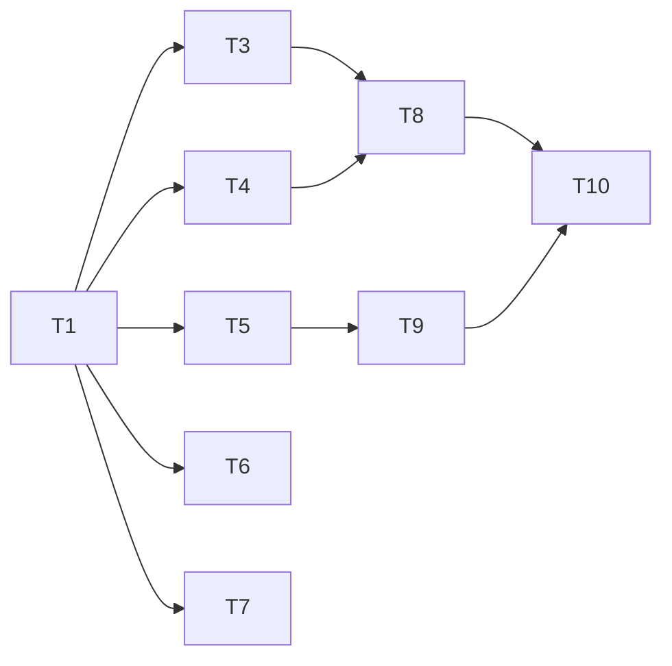

# 示例：Tasks

这是一个完整的Tasks示例，对应 `demo_spec.md` 中的Spec。

---

# Tasks: 用户登录注册系统

## 概述

实现用户登录注册系统，包括注册、登录、个人资料修改功能。
总任务数：10个，预估工作量：3人天。

## 任务清单

### Phase 1: 基础设施

此阶段包含搭建项目结构、创建数据库表等准备工作

| ID | 任务描述 | 依赖 | 复杂度 | 验收 |
|----|----------|------|--------|------|
| T1 | 创建用户表User和Token表 | - | S | 表结构符合demo_spec.md设计 |
| T2 | 配置项目结构和依赖 | - | S | 项目可启动 |

### Phase 2: 核心功能

此阶段实现核心业务逻辑

| ID | 任务描述 | 依赖 | 复杂度 | 验收 |
|----|----------|------|--------|------|
| T3 | 实现用户注册API | T1 | M | AC1, AC2, AC3通过 |
| T4 | 实现用户登录API | T1 | M | AC4, AC5, AC6通过 |
| T5 | 实现JWT Token生成 | T4 | M | Token格式正确 |
| T6 | 实现修改昵称API | T1 | S | AC7, AC8通过 |
| T7 | 实现上传头像API | T1 | M | AC9通过 |

### Phase 3: 边界与集成

此阶段处理异常情况、集成测试等

| ID | 任务描述 | 依赖 | 复杂度 | 验收 |
|----|----------|------|--------|------|
| T8 | 统一错误处理 | T3, T4 | S | 返回格式统一 |
| T9 | Token验证中间件 | T5 | M | AC10通过 |
| T10 | 单元测试 | T8, T9 | M | AC1-AC10通过 |

## 依赖图

## 任务详情

### T1: 创建用户表和Token表
- **描述**: 按demo_spec.md第4节数据模型创建表结构
- **技术方案**: 使用SQL/ORM创建表，配置索引
- **验收标准**: 
  - User表字段完整（id, email, password_hash, nickname, avatar_url, status, last_login_at, created_at, updated_at, deleted_at）
  - AccessToken表字段完整（id, user_id, token, expires_at, created_at, deleted_at）
  - email唯一索引已创建

### T2: 配置项目结构和依赖
- **描述**: 初始化项目，配置bcrypt、jwt等依赖
- **技术方案**: npm init / cargo new 等
- **验收标准**: 
  - 项目可正常启动
  - 测试环境可运行

### T3: 实现用户注册API
- **描述**: 实现POST /api/v1/users/register
- **技术方案**: 
  - 参数校验：邮箱格式（正则）、密码强度、两次密码一致
  - 业务校验：邮箱唯一性
  - 密码bcrypt加密存储
- **验收标准**:
  - AC1: 输入有效邮箱和密码，返回201
  - AC2: 输入已存在邮箱，返回409
  - AC3: 密码少于8位，返回400

### T4: 实现用户登录API
- **描述**: 实现POST /api/v1/users/login
- **技术方案**: 
  - 根据email查找用户
  - bcrypt验证密码
  - 调用Token生成服务
- **验收标准**:
  - AC4: 输入正确凭证，返回200和Token
  - AC5: 输入错误密码，返回401
  - AC6: 输入不存在邮箱，返回401

### T5: 实现JWT Token生成
- **描述**: 生成JWT Token服务
- **技术方案**: 
  - 使用jsonwebtoken库
  - 设置7天过期时间
  - 存储Token到数据库
- **验收标准**: Token格式正确，可解析

### T6: 实现修改昵称API
- **描述**: 实现PUT /api/v1/users/me/nickname，登录认证
- **技术方案**: 更新用户nickname字段
- **验收标准**:
  - AC7: 未登录返回401
  - AC8: 昵称超长返回400

### T7: 实现上传头像API
- **描述**: 实现POST /api/v1/users/me/avatar，上传文件
- **技术方案**: 
  - 文件类型校验（jpg/png）
  - 文件大小校验（<2MB）
  - 上传到云存储（OSS/S3）
- **验收标准**:
  - AC9: 文件超过2MB返回400

### T8: 统一错误处理
- **描述**: API错误格式化
- **技术方案**: 中间件统一处理错误返回格式
- **验收标准**: 所有错误返回格式一致

### T9: Token验证中间件
- **描述**: 验证请求中的Token
- **技术方案**: 
  - 解析Header中的Bearer Token
  - 验证Token有效性
  - 检查过期时间
- **验收标准**:
  - AC10: Token过期后返回401

### T10: 单元测试
- **描述**: 编写单元测试
- **技术方案**: jest / pytest 等
- **验收标准**: AC1-AC10全部通过，覆盖率>80%

---

## 实施顺序建议

1. **Day 1**: T1 -> T2 -> T3
2. **Day 2**: T4 -> T5 -> T6 -> T7
3. **Day 3**: T8 -> T9 -> T10

---

**注意**: 这个Tasks已经过用户确认，可以开始开发。

对应Spec：`examples/demo_spec.md`