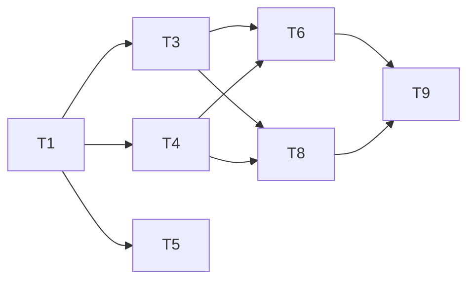

# Tasks 模板

## 模板结构

```markdown
# Tasks: [功能名称]

## 概述
- 功能描述
- 总任务数：X个
- 预估工作量：Y人天

## 任务清单

### Phase 1: 基础设施 [可选]
此阶段包含搭建项目结构、创建数据库表等准备工作

| ID | 任务描述 | 依赖 | 复杂度 | 验收 |
|----|----------|------|--------|------|
| T1 | 创建数据库表/模型 | - | S | 表结构已创建 |
| T2 | 配置项目结构 | - | S | 目录结构符合规范 |

### Phase 2: 核心功能
此阶段实现核心业务逻辑

| ID | 任务描述 | 依赖 | 复杂度 | 验收 |
|----|----------|------|--------|------|
| T3 | 实现用户注册API | T1 | M | AC1, AC2通过 |
| T4 | 实现用户登录API | T1, T3 | M | AC3通过 |
| T5 | 实现密码重置API | T1 | L | 邮件发送成功 |

### Phase 3: 边界与集成
此阶段处理异常情况、集成测试等

| ID | 任务描述 | 依赖 | 复杂度 | 验收 |
|----|----------|------|--------|------|
| T6 | 统一错误处理 | T3, T4 | S | 返回格式统一 |
| T7 | 日志记录 | - | S | 关键操作已记录 |
| T8 | 单元测试 | T3, T4 | M | 覆盖率>80% |
| T9 | 集成测试 | T6, T7 | M | 核心流程通过 |

## 依赖图（Mermaid格式）



## 任务详情

### T1: 创建用户表
- **描述**: 创建用户表结构，包含邮箱、密码hash、状态等字段
- **技术方案**: 使用XXX ORM
- **验收标准**: 
  - 表结构符合设计
  - 索引已创建

### T2: 实现用户注册API
- **描述**: 实现用户注册接口，包括参数校验、密码加密、数据库写入
- **技术方案**: 
  - 密码使用bcrypt加密
  - 邮箱唯一性校验
- **验收标准**:
  - AC1: 输入有效邮箱和密码，返回200
  - AC2: 输入已存在邮箱，返回400

...
```

## 填写指南

### Phase划分原则
- **Phase 1 (基础设施)**: 数据库、配置、基础架构
- **Phase 2 (核心功能)**: 业务逻辑实现
- **Phase 3 (边界与集成)**: 异常处理、测试、部署

### 复杂度标记
- **S (Small)**: 1-2小时
- **M (Medium)**: 2-4小时
- **L (Large)**: 4-8小时
- **XL (Extra Large)**: 超过1天

### 依赖关系
- 列出前置任务ID
- 如果没有前置任务，使用"-"

### 验收标准
- 关联Spec中的验收标准ID
- 例如：AC1, AC2

### 任务详情（可选）
- 对于复杂任务，可以添加详细信息
- 包括：技术方案、具体实现思路、注意事项
